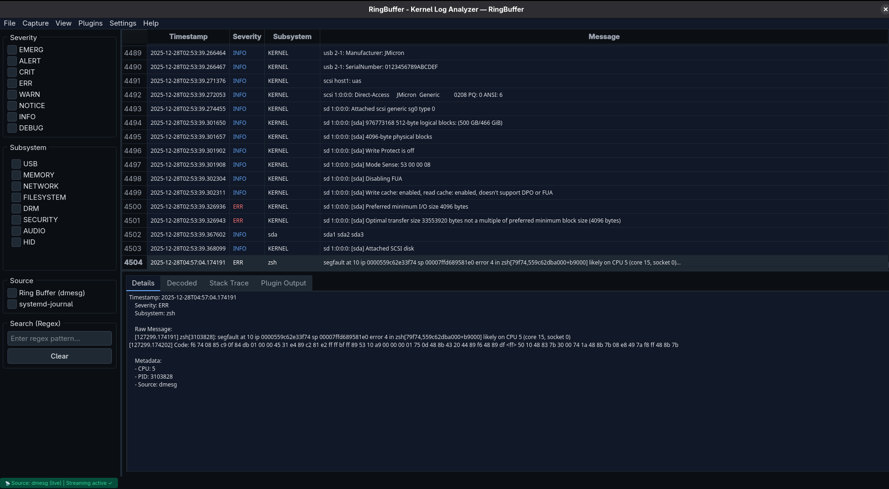

# RingBuffer

[](https://github.com/The-OffSec-Desk/ringbuffer/releases/tag/v1.0.0)
[](https://github.com/The-OffSec-Desk/ringbuffer/releases/tag/v1.0.0)
[](LICENSE)

**RingBuffer** is a native desktop application that provides real-time, structured access to the Linux kernel ring buffer. It exposes the same kernel messages behind `dmesg`, but in a live, searchable, and extensible GUI designed for kernel developers, security researchers, and system engineers.

**This is not a wrapper. This is a streaming kernel log engine with a professional frontend.**



---

## 🚀 Quick Start

### Download & Run (No Installation Required)

```bash
# Download the latest release
curl -L -o RingBuffer-x86_64.AppImage https://github.com/The-OffSec-Desk/ringbuffer/releases/download/v1.0.0/RingBuffer-x86_64.AppImage

curl -L -o install-icon.sh https://github.com/The-OffSec-Desk/ringbuffer/releases/download/v1.0.0/install-icon.sh

curl -L -o RingBuffer-x86_64.AppImage.sha256 https://github.com/The-OffSec-Desk/ringbuffer/releases/download/v1.0.0/RingBuffer-x86_64.AppImage.sha256

# Verify
sha256sum -c RingBuffer-x86_64.AppImage.sha256


# Make executable
chmod +x RingBuffer-x86_64.AppImage

# Run
./RingBuffer-x86_64.AppImage
```

### Install Desktop Integration (Recommended)

```bash
# Download both files
wget https://github.com/The-OffSec-Desk/ringbuffer/releases/download/v1.0.0/RingBuffer-x86_64.AppImage
wget https://github.com/The-OffSec-Desk/ringbuffer/releases/download/v1.0.0/install-icon.sh
wget https://github.com/The-OffSec-Desk/ringbuffer/releases/download/v1.0.0/RingBuffer-x86_64.AppImage.sha256

# Make executable
chmod +x RingBuffer-x86_64.AppImage

# Install to system
bash install-icon.sh
```

After installation, RingBuffer will appear in your application menu with proper icon.

---

## ✨ Features (v1.0)

### Core Engine
- **Real-time kernel log streaming** - Event-for-event parity with `dmesg -w`
- **Lossless ingestion** - No dropped or reordered messages
- **Accurate timestamp handling** - Monotonic → realtime conversion
- **Severity classification** - INFO / WARN / ERROR / CRITICAL / ALERT / EMERG
- **Subsystem-aware parsing** - USB, NET, FS, KERNEL, and more
- **Continuation line detection** - Stack traces and hex dumps properly grouped

### User Interface
- **Native desktop GUI** - Built with PySide6 (Qt)
- **Syntax highlighting** - Color-coded severity levels
- **Real-time filtering** - Filter by severity, subsystem, or keywords
- **Export capabilities** - Save filtered logs for analysis
- **Plugin system** - Extensible architecture for custom analyzers
  **Modern UI** - Clean, professional interface

### Architecture
- **Decoupled backend and UI** - Stable under heavy load
- **Event-driven design** - Efficient message processing
- **Thread-safe** - Multiple concurrent operations
- **Zero installation** - Single portable AppImage

---

## Why RingBuffer Exists

Kernel logs are critical, but `dmesg` is:
- **Linear** - No structure or context
- **Ephemeral** - Lost on reboot
- **Hard to analyze at scale** - Difficult pattern recognition
- **Not built for correlation** - No tooling for investigation

**RingBuffer turns kernel messages into a first-class analysis stream.**

### Use Cases

- **Kernel debugging** - Live debugging with structured output
- **Driver development** - Monitor driver initialization and operation
- **USB and peripheral analysis** - Track device events in real-time
- **Virtualization/network inspection** - Monitor VM and network events
- **Exploit development & crash analysis** - Analyze kernel panics and oops
- **Incident response and forensics** - Capture and investigate security events
- **System monitoring** - Real-time health and performance insights

---

## 🏗️ Architecture Overview

```
┌─────────────────────────────────────────────────────────┐
│                     User Interface                      │
│  ┌──────────────┐  ┌──────────────┐  ┌──────────────┐   │
│  │  Log View    │  │   Filters    │  │   Plugins    │   │
│  └──────────────┘  └──────────────┘  └──────────────┘   │
└─────────────────────────────────────────────────────────┘
                           ▲
                           │ Qt Signals
                           │
┌─────────────────────────────────────────────────────────┐
│                    Core Engine                          │
│  ┌──────────────┐  ┌──────────────┐  ┌──────────────┐   │
│  │ Log Parser   │  │Event Emitter │  │  Plugins     │   │
│  └──────────────┘  └──────────────┘  └──────────────┘   │
└─────────────────────────────────────────────────────────┘
                           ▲
                           │ Direct Read
                           │
                    ┌──────────────┐
                    │  /dev/kmsg   │
                    └──────────────┘
```

### Components

- **`/dev/kmsg` Reader** - Direct kernel log interface (no polling)
- **Parser Engine** - Structured extraction of severity, subsystem, timestamps
- **Event System** - Thread-safe event emission to UI
- **Plugin Framework** - Modular analyzers for specific subsystems
- **Qt Frontend** - Professional desktop interface

---

## 📋 Requirements

- **OS:** Linux x86_64 (any modern distribution)
- **Kernel:** 4.x or newer
- **Dependencies:** None (all bundled in AppImage)
- **Permissions:** Read access to `/dev/kmsg`

### Granting Permissions

```bash
# Option 1: Run with sudo (quick test)
sudo ./RingBuffer-x86_64.AppImage

# Option 2: Add user to systemd-journal group (recommended)
sudo usermod -aG systemd-journal $USER
# Log out and log back in

# Option 3: Set capabilities (advanced)
sudo setcap cap_syslog=ep RingBuffer-x86_64.AppImage
```

---

## 🔐 Verify Download Integrity

```bash
# Download checksum
wget https://github.com/yourusername/ringbuffer/releases/latest/download/RingBuffer-x86_64.AppImage.sha256

# Verify
sha256sum -c RingBuffer-x86_64.AppImage.sha256
```

Expected output: `RingBuffer-x86_64.AppImage: OK`

---

## 🛠️ Building from Source

```bash
# Clone repository
git clone https://github.com/yourusername/ringbuffer.git
cd ringbuffer

# Create virtual environment
python3 -m venv venv
source venv/bin/activate

# Install dependencies
pip install -r requirements.txt

# Run from source
python3 main.py
```

### Building AppImage

See [BUILD.md](BUILD.md) for detailed instructions on building the AppImage from source.

---

## 🔌 Plugin Development

RingBuffer supports custom plugins for specialized analysis:

```python
from plugins.base import BasePlugin

class MyPlugin(BasePlugin):
    def on_event(self, event):
        if 'USB' in event.subsystem:
            # Custom USB analysis logic
            self.emit_alert(f"USB device: {event.message}")
```

See [PLUGINS.md](PLUGINS.md) for detailed plugin documentation.

---

## 🐛 Troubleshooting

### Icon doesn't show in application menu
```bash
bash install-icon.sh
gtk-update-icon-cache ~/.local/share/icons/hicolor/
# Log out and log back in
```

### Permission denied reading kernel logs
```bash
# Check if you're in the systemd-journal group
groups | grep systemd-journal

# If not, add yourself
sudo usermod -aG systemd-journal $USER
# Log out and log back in
```

### AppImage won't execute
```bash
# Install FUSE
sudo dnf install fuse  # Fedora/RHEL
sudo apt install fuse  # Debian/Ubuntu

# Make sure it's executable
chmod +x RingBuffer-x86_64.AppImage
```

---

## Development Setup

```bash
# Install development dependencies
pip install -r requirements-dev.txt

# Run tests
pytest

# Check code quality
flake8 .
black --check .
```

---

## 📄 License

This project is licensed under the MIT License - see the [LICENSE](LICENSE) file for details.

---

## 🙏 Acknowledgments

- Built with [PySide6](https://doc.qt.io/qtforpython/) (Qt for Python)
- Packaged with [AppImageKit](https://github.com/AppImage/AppImageKit)
- Inspired by the Linux kernel community

---

## 📬 Support & Contact

- **Issues:** [GitHub Issues](https://github.com//ringbuffer/issues)
- **Discussions:** [GitHub Discussions](https://github.com/The-OffSec-Desk/ringbuffer/discussions)
- **Email:** cyberdevhq@proton.me

---

<p align="center">
  <strong>Made with ❤️ for the Linux community</strong>
 </p>
